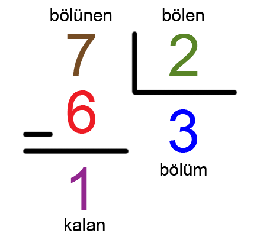

# merhaba dünya!

hadi gelin, ilk kodumuzu yazalım!

```python
print("merhaba dünya")
```

---

# merhaba ____!

adımızla bizi karşılasa bu program çok güzel olur. hemen deneyelim:

```python
ad = input("adınız nedir: ")
print("merhaba", ad)
```

---

### analiz

```python
print()
```

fonksiyonu, argüman olarak verilen değişkeni veya değeri komut satırına yazar.

```python
input()
```

fonksiyonu, argüman olarak verilen yazıyı soru olarak kullanarak komut satırından girdi alır. bu girdi **str** türündedir.

---

# değişkenler

değişkenler, çeşitli değerleri altında sakladığımız adlardır. bu değere erişmek için ve bu değeri değiştirmek için kodumuzda bu adı kullanırız.

---

### örnek:
```python
ad = "mehmet"
soyad = "kurt"
yas = 14
not_ortalamasi = 83.5
programlama_biliyor = False
```

```python
print(ad, soyad)
print("yaş: " + str(yas))
print("not ortalaması: " + str(not_ortalamasi))
```

```
mehmet kurt
yaş: 14
not ortalaması: 83.5
```

---

### analiz

python'da değerlerin farklı türleri vardır.

```python
ad: str = "mehmet" # string (harf dizisi / yazı)
soyad: str = "kurt"
yas: int = 14 # integer (tam sayı)
not_ortalamasi: float = 83.5 # floating-point number (ondalık sayı)
programlama_biliyor: bool = False # boolean (doğru/yanlış)
```

türlere göre değerler farklı fonksiyonlarda kullanabilir, farklı şekilde değiştirilebilir.

---

# matematiksel hesaplar

dört işlem:

```python
7 + 5 # toplama operatörü: +
12 - 9 # çıkarma operatörü: -
3 * 7 # çarpma operatörü: *
8 / 3 # bölme operatörü: /
```

---

### diğer kullanışlı işlemler:


```python
7 // 2 # (tam sayı) bölme operatörü: //
7 % 2 # kalan hesaplama operatörü: %
```

bir de son olarak:

```python
8 ** 3 # kuvvetini alma operatörü: **
```

---